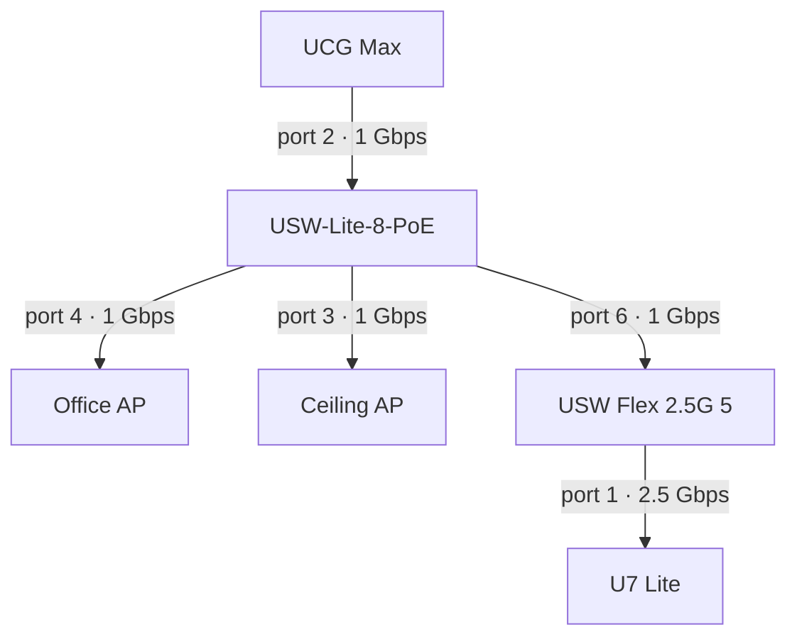

This page covers the network infrastructure and off-host services observed on **2026-09-28**. UniFi device and client data were read without changing configuration.

## Home Assistant

Home Assistant is reachable on the LAN at [192.168.1.254:8123](http://192.168.1.254:8123). Its root page returned HTTP 200. UniFi reported the client online over Wi-Fi with hostname `homeassistant`.

[Caddy](/infrastructure/caddy) sends `ha.ryantr.app` to `192.168.1.254:8123`. Home Assistant is outside the Trappserver Docker inventory. The client label does not establish the physical hardware or installation type.

Version, integrations, automations, backups, and authenticated application health were not inspected. Record the installation method and backup/restore procedure after checking Home Assistant's own administration interface.

## M1 Mac laptop: n8n

The user identifies `192.168.1.163` as the M1 Mac laptop running n8n on HTTP port `5678`. Since **2026-10-03**, [n8n](https://n8n.ryantr.app) uses Caddy's trusted wildcard HTTPS and a `192.168.1.0/24` peer guard. UniFi LAN DNS points the hostname to `192.168.1.236`; no public DNS record or tunnel handler was added. Both direct upstream HTTP and normal LAN hostname HTTPS returned 200. Keep the laptop awake and reachable; its deployment, version, backups, direct-port firewall, authentication and workflows were not inspected. See [Caddy setup](/infrastructure/caddy#lan-only-application-routes) for checks and rollback.

## SMLIGHT coordinator

UniFi reported a wired device at `192.168.1.205` with hostname `SLZB-06U`. Its HTTP root page returned 200. The [SMLIGHT SLZB-06U product reference](https://smlight.tech/products/slzb-06u) identifies this model as an Ethernet Zigbee coordinator.

Current firmware, operating mode, and its relationship to Home Assistant or a Zigbee integration were not inspected. Use the [SMLIGHT manual](https://smlight.tech/manual/slzb-06) alongside the device interface when documenting those settings.

## UniFi infrastructure

Six adopted UniFi devices were reported online:

| Device name | Model reported | LAN address | Firmware |
| --- | --- | --- | --- |
| UCG Max | `UCGMAX` | `192.168.1.1` | `5.1.33.34087` |
| USW-Lite-8-PoE | `USL8LPB` | `192.168.1.91` | `7.5.15.17146` |
| USW Flex 2.5G 5 | `USWED35` | `192.168.1.181` | `2.1.8.971` |
| Office AP | `UAP6MP` | `192.168.1.218` | `6.8.2.15592` |
| Ceiling AP | `UAP6MP` | `192.168.1.231` | `6.8.2.15592` |
| U7 Lite | `UAPA693` | `192.168.1.112` | `8.7.11.19419` |

The gateway's LAN address comes from the configured controller endpoint. Public WAN addresses and hardware identifiers are omitted.

A **2026-09-30** UniFi configuration review found one corporate LAN (`192.168.1.0/24`), one enabled SSID mapped to it, and a WireGuard remote-user network (`192.168.2.0/24`). No separate guest or IoT LAN/VLAN was listed. The current setup therefore has no guest/IoT boundary to validate; adding one requires a separate network and client-side access tests. See [host listeners and network separation](/todo/security-and-consistency#16-review-host-listeners-and-network-separation) for the management-access review.

### Reported wired uplinks

| Downstream device | Parent | Parent port | Link speed |
| --- | --- | --- | --- |
| USW-Lite-8-PoE | UCG Max | 2 | 1 Gbps |
| Office AP | USW-Lite-8-PoE | 4 | 1 Gbps |
| Ceiling AP | USW-Lite-8-PoE | 3 | 1 Gbps |
| USW Flex 2.5G 5 | USW-Lite-8-PoE | 6 | 1 Gbps |
| U7 Lite | USW Flex 2.5G 5 | 1 | 2.5 Gbps |

These are reported uplink speeds at inspection time. The U7 Lite's 2.5 Gbps connection reaches the Flex switch, whose upstream connection was 1 Gbps. This inventory did not measure throughput or audit wireless coverage, firewall policies, or firmware update suitability.

Caddy also contains an internal `unifi.ryantr.app` route targeting the gateway. Its proxy configuration is described on the [Caddy page](/infrastructure/caddy).

## Philips Hue Bridge

The Philips Hue Bridge is at `192.168.1.201`, identified by the homelab owner on **2026-09-29**. UniFi reported this client online over a wired connection during the **2026-09-28** inspection.

The bridge model, firmware, paired lights, and any Home Assistant integration were not inspected.

## Scope of this inventory

The [container inventory](/services/overview) covers Docker applications on Trappserver, while [native host services](/services/host) covers systemd applications on that machine. This page covers the verified infrastructure endpoints above; it does not treat every connected phone, television, or temporary client as a server.
